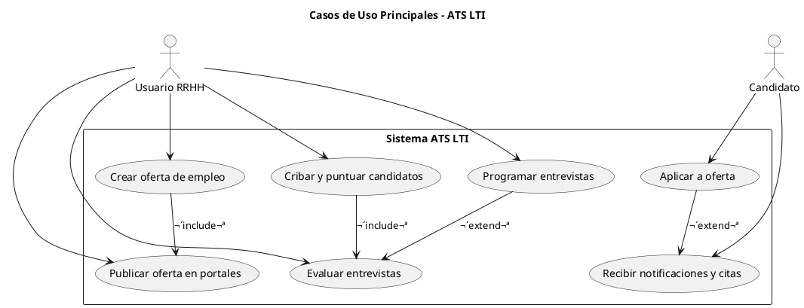

## 🟦 Descripción Breve del Software LTI

**LTI** es un sistema de seguimiento de candidatos (**ATS - Applicant Tracking System**) de nueva generación, diseñado para **agilizar los procesos de selección**, fomentar la **colaboración en tiempo real** entre reclutadores y managers, y potenciar el reclutamiento inteligente gracias a la **integración de inteligencia artificial**.

---

## 💎 Valor Añadido y Ventajas Competitivas

* ✅ **Automatización visual avanzada** de procesos de selección.
* ✅ **Colaboración fluida en tiempo real** entre todos los actores del proceso.
* ✅ **IA aplicada** en cribado, entrevistas y predicción de talento.
* ‚úÖ **Experiencia unificada** para recruiter, manager y candidato.
* ‚úÖ Cumplimiento autom√°tico de **GDPR** y trazabilidad de acciones.
* ‚úÖ Dashboards inteligentes adaptados a cada rol.

---

## üîß Funciones Principales

* **Publicación inteligente de ofertas** en portales y redes.
* **Cribado autom√°tico de CVs** y ranking seg√∫n perfil ideal.
* **Espacio colaborativo compartido** recruiter-manager con feedback instant√°neo.
* **Programación automática de entrevistas** con integración de calendario.
* **Evaluaciones asistidas por IA** en entrevistas y entrevistas autom√°ticas.
* **Workflows personalizables** con automatismos condicionales.
* **CRM de talento** para seguimiento de candidatos pasivos.
* **Reporting avanzado** y alertas sobre bloqueos o retrasos.
* **Módulo de onboarding automatizado** tras contratación.

---

## üåê Lean Canvas de LTI

| Elemento                 | Contenido                                                                                                                                        |
| ------------------------ | ------------------------------------------------------------------------------------------------------------------------------------------------ |
| **Problema**             | Procesos largos, poco colaborativos y manuales en la selección. Dificultad para gestionar muchos candidatos y garantizar cumplimiento normativo. |
| **Segmentos de cliente** | Departamentos de RRHH, consultoras de selección, empresas de tecnología y crecimiento rápido.                                                    |
| **Propuesta de valor**   | ATS intuitivo y colaborativo que automatiza el proceso, potencia decisiones con IA y mejora la experiencia del candidato y del equipo.           |
| **Solución**             | Publicación múltiple, cribado automático, IA evaluadora, workflows visuales, dashboards por rol, onboarding automático.                          |
| **Canales**              | Web oficial, partners de software de RRHH, ferias sectoriales, integraciones con ERPs y CRMs.                                                    |
| **Flujos de ingresos**   | Suscripción SaaS mensual/anual por empleado. Planes escalables según tamaño de empresa.                                                          |
| **Estructura de costes** | Desarrollo de software, servidores cloud, soporte, marketing, integraciones, I+D en IA.                                                          |
| **Métricas clau**        | Tiempo medio de contratación, tasa de conversión, tasa de abandono, NPS interno (reclutadores/managers), activación de automatismos.             |
| **Ventaja competitiva**  | IA integrada + interfaz colaborativa + cumplimiento legal autom√°tico + onboarding conectado.                                                     |

### üß© Diagrama de casos de uso en PlantUML

```plantuml
@startuml
title Casos de Uso Principales - ATS LTI

' Definición de actores
actor "Usuario RRHH" as HR
actor "Candidato" as Candidate

' Sistema ATS
rectangle "Sistema ATS LTI" {

  ' Casos de uso del Usuario RRHH
  usecase "Crear oferta de empleo" as UC1
  usecase "Publicar oferta en portales" as UC2
  usecase "Cribar y puntuar candidatos" as UC3
  usecase "Programar entrevistas" as UC4
  usecase "Evaluar entrevistas" as UC5

  ' Casos de uso del Candidato
  usecase "Aplicar a oferta" as UC6
  usecase "Recibir notificaciones y citas" as UC7
}

' Relación de actores con casos de uso
HR --> UC1
HR --> UC2
HR --> UC3
HR --> UC4
HR --> UC5

Candidate --> UC6
Candidate --> UC7

' Relaciones entre casos de uso
UC1 --> UC2 : «include»
UC3 --> UC5 : «include»
UC4 --> UC5 : «extend»
UC6 --> UC7 : «extend»

@enduml
```

---

### üìù Notas de modelado UML:

* `include`: Se usa cuando un caso de uso **siempre implica otro**. Por ejemplo, *crear oferta* siempre lleva a *publicar*.
* `extend`: Se usa cuando un caso de uso **puede opcionalmente derivar en otro**. Por ejemplo, tras *aplicar*, el candidato podría *recibir notificación*, pero no siempre.
* Los actores est√°n bien diferenciados: el **usuario de RRHH** es el que gestiona procesos; el **candidato** interact√∫a en la parte externa.
* Los casos de uso están enmarcados dentro del sistema **ATS LTI**, siguiendo la convención de encapsular funcionalidades.

---

## üìò Entidades principales del modelo de datos de LTI

### 1. **OfertaDeEmpleo**

* **Descripción**: Representa una vacante publicada.
* **Campos clave**:

  * `id` (PK)
  * `titulo`
  * `descripcion`
  * `departamento`
  * `ubicacion`
  * `fechaPublicacion`
  * `estado` (activa, cerrada, borrador)
  * `creadaPor` (FK a Usuario)
* **Relaciones**:

  * 1\:N con `Candidatura`
  * N:1 con `Usuario` (recruiter)

---

### 2. **Candidato**

* **Descripción**: Persona que aplica a una o más ofertas.
* **Campos clave**:

  * `id` (PK)
  * `nombre`
  * `email`
  * `telefono`
  * `linkedin`
  * `cvUrl`
  * `fechaRegistro`
* **Relaciones**:

  * 1\:N con `Candidatura`
  * 1\:N con `Entrevista`

---

### 3. **Candidatura**

* **Descripción**: Postulación específica de un candidato a una oferta.
* **Campos clave**:

  * `id` (PK)
  * `idCandidato` (FK)
  * `idOferta` (FK)
  * `fechaAplicacion`
  * `estadoProceso` (nuevo, preseleccionado, entrevista, descartado, contratado)
  * `scoreIA`
  * `feedback`
* **Relaciones**:

  * N:1 con `OfertaDeEmpleo`
  * N:1 con `Candidato`
  * 1\:N con `Entrevista`
  * 1\:N con `Evaluacion`

---

### 4. **Usuario**

* **Descripción**: Persona que usa el sistema (reclutador, manager, HR).
* **Campos clave**:

  * `id` (PK)
  * `nombre`
  * `email`
  * `rol` (Recruiter, Manager, Admin)
  * `departamento`
* **Relaciones**:

  * 1\:N con `OfertaDeEmpleo` (si es creador)
  * 1\:N con `Evaluacion`
  * 1\:N con `Entrevista` (como entrevistador)

---

### 5. **Entrevista**

* **Descripción**: Cita entre candidato y entrevistadores.
* **Campos clave**:

  * `id` (PK)
  * `idCandidatura` (FK)
  * `fecha`
  * `tipo` (presencial, remota)
  * `urlMeet`
  * `entrevistadorId` (FK a Usuario)
* **Relaciones**:

  * N:1 con `Candidatura`
  * N:1 con `Usuario`

---

### 6. **Evaluacion**

* **Descripción**: Resultado y feedback de una entrevista.
* **Campos clave**:

  * `id` (PK)
  * `idCandidatura` (FK)
  * `usuarioId` (FK)
  * `score`
  * `comentarios`
  * `fecha`
* **Relaciones**:

  * N:1 con `Candidatura`
  * N:1 con `Usuario`

---

### 7. **Workflow**

* **Descripción**: Configuración del flujo de etapas para una oferta.
* **Campos clave**:

  * `id` (PK)
  * `nombre`
  * `etapas[]` (array ordenado: CV, Entrevista técnica, Oferta…)
* **Relaciones**:

  * 1\:N con `OfertaDeEmpleo`

---

## 🔗 Relación de entidades (resumen):

* **Usuario** ‚Üê crea ‚Üí **OfertaDeEmpleo**
* **OfertaDeEmpleo** ‚Üê tiene ‚Üí **Candidatura**
* **Candidatura** ‚Üê la hace ‚Üí **Candidato**
* **Candidatura** ‚Üê incluye ‚Üí **Entrevista** y **Evaluacion**
* **Evaluacion** ‚Üê la emite ‚Üí **Usuario**
* **Entrevista** ‚Üê la hace ‚Üí **Usuario**
* **OfertaDeEmpleo** ‚Üê usa ‚Üí **Workflow**

---

## Diagrama C4

Caso de uso "pulbicar nueva oferta de empleo"

@startuml C4_PublicarOferta
!include <C4/C4_Container>

Person(recruiter, "Recruiter (HR)", "Usuario del departamento de RRHH que crea y publica ofertas")
System_Ext(job_borad, "Job Board", "Sistema externo donde se publica la oferta")
System(ats, "ATS LTI", "Sistema de seguimiento de candidatos")

Container(ats_web, "Web App ATS", "Web UI", "Permite crear y gestionar ofertas")
Container(ats_api, "API ATS", "REST API", "Expone servicios para publicación e integración")
Container(db, "Base de datos ATS", "Relacional", "Almacena datos de ofertas, usuarios, pipelines")

Rel(recruiter, ats_web, "Usa para crear/editar oferta")
Rel(ats_web, ats_api, "Llama API para guardar oferta")
Rel(ats_api, db, "Lee/Escribe registros de oferta")
Rel(ats_api, job_borad, "Publica oferta")

Rel(recruiter, job_borad, "Ve oferta publicada")

@enduml

@startuml C4_Components_PublicarOferta
!include <C4/C4_Container>
!include <C4/C4_Component>

LAYOUT_WITH_LEGEND()

' Containers de context
Person(recruiter, "Recruiter", "Usuari RH que publica una oferta")
System_Ext(job_board, "Job Board", "Portal extern on es publica l'oferta")
System_Boundary(ats_api, "ATS API") {

  Component(OfertaController, "OfertaController", "REST Controller", "Exposa endpoints per crear i publicar ofertes")
  Component(OfertaService, "OfertaService", "Aplicació", "Conté la lògica per validar i gestionar les ofertes")
  Component(PublicadorJobBoard, "PublicadorJobBoard", "Connector", "Connecta amb plataformes externes per publicar ofertes")
  Component(OfertaRepository, "OfertaRepository", "Accés a dades", "Accedeix a la base de dades per persistir ofertes")
}

Rel(recruiter, OfertaController, "Fes petició HTTP POST")
Rel(OfertaController, OfertaService, "Crida")
Rel(OfertaService, OfertaRepository, "Guarda oferta")
Rel(OfertaService, PublicadorJobBoard, "Publica en canal extern")
Rel(PublicadorJobBoard, job_board, "Envia oferta publicada via API")

@enduml

