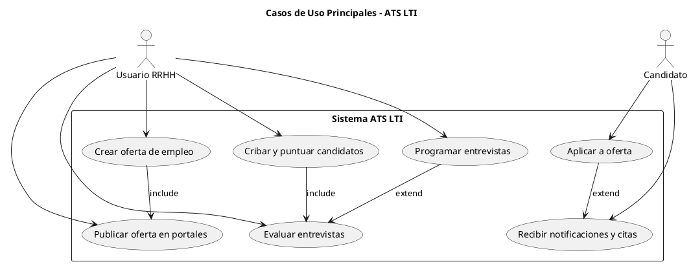
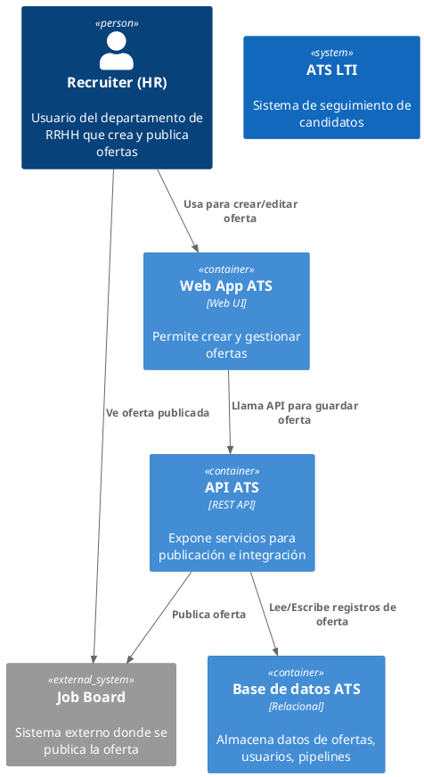
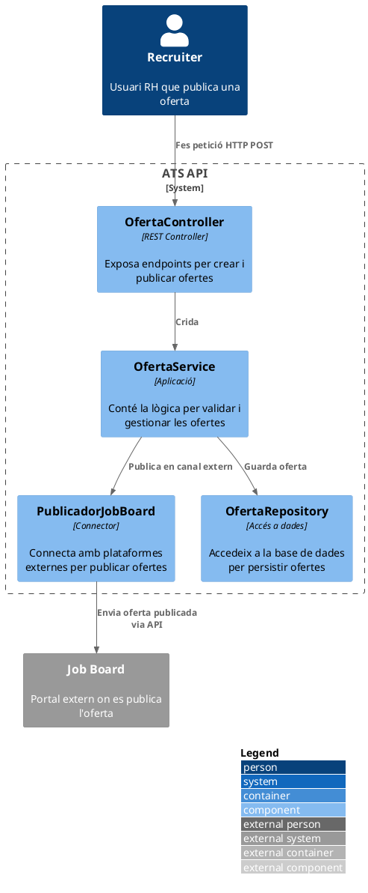

# Prompts

He usado GatGPT 4o durante todo el proceso

Aquí está el enlace: https://chatgpt.com/share/684eee26-cf68-8001-88d2-f460a65f705d

## Descripción breve del softsare LTI, valor añadido y ventajas competitivas.

Eres un experto en producto, con experiencia en sistemas ATS (Applicant Tracking Systems). Enumera y explica brevemente cuales son las funcionalidades básicas que tiene un ATS.

Claro, aquí tienes una enumeración con una breve explicación de las **funcionalidades básicas que debe tener un sistema ATS (Applicant Tracking System)**:

---

### ✅ 1. **Publicación de ofertas de empleo**

Permite crear, gestionar y publicar ofertas de trabajo en múltiples canales: portales de empleo, redes sociales, página de "Trabaja con nosotros", etc.

### ✅ 2. **Gestión de candidaturas**

Recoge y centraliza todas las candidaturas recibidas, ya sean de portales externos, referidos o aplicaciones directas, en un solo sistema organizado.

### ✅ 3. **Cribado y filtrado de CVs**

Facilita el filtrado automático de candidatos usando criterios como palabras clave, experiencia, habilidades, ubicación o puntuación basada en IA.

### ✅ 4. **Base de datos de talento**

Construye un histórico de candidatos (incluso no seleccionados), permitiendo buscarlos y reutilizarlos para futuras vacantes.

### ✅ 5. **Workflow de selección personalizable**

Configura etapas del proceso de selección (screening, entrevista técnica, entrevista con RRHH, oferta, etc.) y automatiza transiciones y notificaciones.

### ✅ 6. **Comunicación con candidatos**

Integra correo electrónico, plantillas, SMS y notificaciones automáticas para mantener informados a los candidatos durante el proceso.

### ✅ 7. **Agenda y coordinación de entrevistas**

Permite coordinar entrevistas entre candidatos y entrevistadores, integrándose con calendarios (Google, Outlook) y ofreciendo opciones de videoentrevista.

### ✅ 8. **Evaluación y feedback**

Permite que los entrevistadores califiquen a los candidatos y compartan comentarios internos con el equipo de selección.

### ✅ 9. **Gestión de informes y analítica**

Ofrece métricas como: tiempo medio de contratación, ratio de conversión entre fases, origen de candidatos, diversidad, etc.

### ✅ 10. **Cumplimiento legal y protección de datos (GDPR)**

Incluye funciones para el consentimiento informado, periodos de retención de datos, anonimización de CVs, y acceso por roles.

---

¿Quieres que te prepare una tabla comparativa entre ATS populares como **Greenhouse**, **Teamtailor**, **Lever**, o **Workable**? ¿O prefieres ejemplos más centrados en entornos europeos o específicos para España?

si, prepara una tabla comparativa entre los ATS más populares indicando cuales són los mas usados, fortalezas i debilidades de cada uno.

Aquí tienes una **comparativa actualizada** entre los ATS más populares en 2025, incluyendo su uso, fortalezas y debilidades:

| ATS            | Uso general / Popularidad                                                                          | Fortalezas principales 🟢                                                                                                                                                                                                                                                                                              | Debilidades principales 🔴                                                                                                                                                                                        |
| -------------- | -------------------------------------------------------------------------------------------------- | ---------------------------------------------------------------------------------------------------------------------------------------------------------------------------------------------------------------------------------------------------------------------------------------------------------------------- | ----------------------------------------------------------------------------------------------------------------------------------------------------------------------------------------------------------------- |
| **Greenhouse** | Muy usado por medianas y grandes empresas; alta satisfacción de usuarios (\~88 %) ([avahr.com][1]) | • Amplias herramientas de automatización y reporting  • Evaluaciones granulares por puesto  • Enfoque en diversidad/inclusión y publicación multicanal (1 000+ tableros)                                                                                                                                         | • Coste elevado; no hay versión gratuita  • Curva de aprendizaje pronunciada ([trustradius.com][2]) • Algunas críticas a la usabilidad del UI y herramientas de reporte “no‑tan‑pulidas”                    |
| **Workable**   | Muy popular en pymes y medianas; usuario satisfecho (\~89 %)                                       | • Publicación rápida en cientos de portales; interfaz tipo “drag‑and‑drop”  • IA para generar descripciones de puestos y pre‑selección ([getapp.com][3]) • Plantillas de ofertas y automatización de onboarding muy bien valoradas (9.7/10 en G2) ([g2.com][4]) • Excelente soporte (9.9 en G2) ([g2.com][4]) | • Opciones de personalización limitadas en empresas grandes  • Falta de funciones avanzadas (e.j. verificación de referencias, onboarding completo) ([b2breviews.com][5]) • Precio no siempre transparente  |
| **Lever**      | Muy usado en empresas tech y corporativas; ampliamente recomendado                                 | • ATS + CRM integrado (TRM) → potente para engagement y mantenimiento de talento  • Alta automatización en procesos; más de 100 integraciones ([techradar.com][6]) • Orientado a diversidad y encuestas a candidatos ([techradar.com][6])                                                                        | • Menos opciones de evaluación técnica y test comparado con Greenhouse  • Pocas características de background screening o assessments ([techradar.com][6])                                                     |
| **Teamtailor** | Creciente uso en Europa especialmente pymes; muy valorado por su UI                                | • Económico (≈€3–5/empleado/mes)  • Fuerte branding: career sites atractivos y personalizables ([outsail.co][7]) • Muy fácil de usar, onboarding rápido ([outsail.co][7]) • Soporte a DEI, pipeline visual y movilidad entre fases ([outsail.co][7])                                                          | • No escalable para grandes empresas; funciones avanzadas limitadas  • Reporting básico, carece analítica avanzada  • Pocas integraciones externas, y personalización CSS/estructura limitada               |

---

### 🧭 Resumen ✔️

* **Greenhouse** es ideal para empresas medianas–grandes que buscan potencia analítica, estructuras sólidas y enfoque en diversidad, aunque a precio premium.
* **Workable** ofrece gran agilidad, incluso IA y onboarding eficaz, perfecto para pymes que valoran rapidez y usabilidad.
* **Lever** combina CRM y automatización útil para mantener engagement, especialmente en entornos tech.
* **Teamtailor** es excelente como primer ATS para pequenas empresas europeas, gracias a su precio, facilidad y branding, si no se requieren funciones avanzadas.

---

¿Te gustaría que prepare una comparativa focalizada en el mercado español, con precios locales, o incluyendo otros ATS como SmartRecruiters, BambooHR, o iCIMS?

[1]: https://avahr.com/greenhouse-vs-lever-vs-workable/?utm_source=chatgpt.com "Greenhouse vs Lever vs Workable: Is There Another ATS Option?"
[2]: https://www.trustradius.com/products/teamtailor/reviews?utm_source=chatgpt.com "Teamtailor Reviews & Ratings 2025 - TrustRadius"
[3]: https://www.getapp.com/hr-employee-management-software/a/teamtailor/reviews/?utm_source=chatgpt.com "Teamtailor Reviews - Pros & Cons, Ratings & more | GetApp 2025"
[4]: https://www.g2.com/compare/greenhouse-vs-workable?utm_source=chatgpt.com "Compare Greenhouse vs. Workable - G2"
[5]: https://www.b2breviews.com/reviews/teamtailor/?utm_source=chatgpt.com "Teamtailor Reviews 2025"
[6]: https://www.techradar.com/best/recruitment-platforms?utm_source=chatgpt.com "Best recruitment platform of 2025"
[7]: https://www.outsail.co/post/teamtailor-reviews---pricing-pros-cons-and-user-feedback?utm_source=chatgpt.com "Teamtailor Reviews – Pricing, Pros/Cons, and User Feedback"

## Explicación de las funciones principales

queremos crear un ATS con funcionalidades clave que harán brillar a LTI por encima de los competidores: aumentar la eficiencia para los departamentos de HR, mejorar la colaboración en tiempo real entre reclutadores y managers, automatizaciones, asistencia de IA en diversas tareas... Investiga las funcionalidades de nuestros principales competidores (páginas web, documentación y opiniones de usuarios) y proporciona ideas 

Aquí tienes un análisis de las **funcionalidades clave de los competidores** y algunas **ideas para diferenciar el ATS de LTI**:

---

## 🧰 Funcionalidades actuales de los principales ATS

### **Greenhouse**

* **IA integrada**: genera descripciones de puestos, planifica entrevistas, personaliza emails de captación y resume informes y feedback automáticamente ([reddit.com][1], [greenhouse.com][2]).
* **Automatización de entrevistas**: sugerencias de horarios, límites de carga, y enlaces para que el candidato reserve directamente .
* **Reporting avanzado**: creación de informes con prompts sencillos, scorecards refinadas por IA ([greenhouse.com][2]).

### **Lever**

* **Workflows automatizados**: triggers que disparan emails, encuestas de feedback, asignan tareas o envían recordatorios ([recruitee.com][3]).
* **IA en sourcing y screening**: agentes IA que personalizan mensajes, califican candidatos, y aprenden con el tiempo ([greenhouse.com][2]).
* **Herramientas de engagement**: encuestas a candidatos, interfaces de chat para entrevistas automatizadas (Sapia/HeyMilo) ([sapia.ai][4]).
* **Colaboración en equipo**: feedback compartido, analytics integradas, integración con herramientas externas ([reddit.com][1]).

### **Workable**

* **Interfaz intuitiva y colaboración real-time**: paneles compartidos, feedback instantáneo, gestión colaborativa de perfiles .
* **Multiposting inteligente**: publicar en +200 job boards, embebido en web, sourcing de base propia .
* **Automatización práctica**: parsing CV, programación de entrevistas con integración calendario, onboarding básico ([g2.com][5]).
* **Enfoque en DEI**: descripciones inclusivas, anonimización y métricas de diversidad ([workable.com][6]).

---

## 🚀 Oportunidades para LTI

| Áreas clave                       | Propuesta de diferenciación para LTI                                                                                                     |
| --------------------------------- | ---------------------------------------------------------------------------------------------------------------------------------------- |
| **Colaboración en tiempo real**   | Estructura “workspace” compartido por recruiter y hiring manager con live chat, comentarios en CVs y coedición de reclutamientos.        |
| **Automatizaciones avanzadas**    | Constructor visual de workflows (drag‑and‑drop), con triggers (etiquetas, fases, fechas) y condiciones lógicas.                          |
| **IA proactiva**                  | Asistente conversacional que sugiere tareas, analiza datos históricos, prevé cuellos de botella y crea campañas de outreach optimizadas. |
| **IA en entrevista**              | Bot que califica respuestas (texto/audio), extrae competencias y detecta sesgos. Incluye feedback automático al candidato.               |
| **Gestión del compromiso (CRM)**  | Pipeline de talento a largo plazo con scoring, cadencia de comunicaciones y alertas automáticas.                                         |
| **Reporting colaborativo**        | Dashboards personalizables en roles (CEO, Manager, Recruiter), con alerts en tiempo real si un proceso se retrasa o falta feedback.      |
| **UX adaptable**                  | Interfaz modular, según rol, con vistas simplificadas, colores configurables e integraciones (Teams, Slack, etc.).                       |
| **GDPR & compliance inteligente** | Registro automático de consentimientos, borrado automático por cadencia legal, trazabilidad avanzada.                                    |
| **Integraciones enriquecidas**    | Marketplace con plugins IA (análisis jurídico, verificación, videoentrevista) tipo “one‑click integrate”.                                |
| **Onboarding automático**         | Generación dinámica de flujos de onboarding basados en el perfil contratado, con tareas asignadas y seguimiento.                         |

---

### ✅ Propuesta de valor de LTI

* **Eficiencia**: menos tareas rutinarias gracias a IA y automatización visual.
* **Colaboración fluida**: todo en un espacio compartido, eliminando silos entre reclutadores y managers.
* **Experiencia humana potenciada por IA**: evaluaciones justas, feedback útil y engagement personalizado.
* **Flexibilidad y control**: workflows personalizables, roles con dashboards a medida, y cumplimiento automatizado.

---

Si te interesa, puedo ayudarte a estructurar un roadmap modular, priorizando funciones MVP para test interno con HR/tech, y definir KPIs de éxito (tiempo de contratación, satisfacción interna, tasa de ofertas aceptadas, etc.). ¡Solo dime!

[1]: https://www.reddit.com/r/Recruitment/comments/1ct9pt7/is_anyone_using_lever_as_an_ats/?utm_source=chatgpt.com "Is anyone using Lever as an ATS? : r/Recruitment - Reddit"
[2]: https://www.greenhouse.com/greenhouse-latest-features?utm_source=chatgpt.com "What's new - Greenhouse"
[3]: https://recruitee.com/articles/ats-for-collaborative-hiring?utm_source=chatgpt.com "How to use your ATS for collaborative hiring - Recruitee"
[4]: https://sapia.ai/resources/blog/lever-interview-automation-ats/?utm_source=chatgpt.com "Lever AI & ATS: Streamlining Recruitment with Hiring Tools - Sapia.ai"
[5]: https://www.g2.com/products/workable/features?utm_source=chatgpt.com "Workable Features - G2"
[6]: https://www.workable.com/features?utm_source=chatgpt.com "Workable features | Complete HR and hiring platform"

## Añadir un diagrama Lean Canvas para entender el modelo de negocio

Prepara una descripción breve del software LTI, valor añadido y ventajas competitivas. Explicación de las funciones principales. Añade un diagrama Lean Canvas para entender el modelo de negocio

## 🟦 Descripción Breve del Software LTI

**LTI** es un sistema de seguimiento de candidatos (**ATS - Applicant Tracking System**) de nueva generación, diseñado para **agilizar los procesos de selección**, fomentar la **colaboración en tiempo real** entre reclutadores y managers, y potenciar el reclutamiento inteligente gracias a la **integración de inteligencia artificial**.

---

## 💎 Valor Añadido y Ventajas Competitivas

* ✅ **Automatización visual avanzada** de procesos de selección.
* ✅ **Colaboración fluida en tiempo real** entre todos los actores del proceso.
* ✅ **IA aplicada** en cribado, entrevistas y predicción de talento.
* ✅ **Experiencia unificada** para recruiter, manager y candidato.
* ✅ Cumplimiento automático de **GDPR** y trazabilidad de acciones.
* ✅ Dashboards inteligentes adaptados a cada rol.

---

## 🔧 Funciones Principales

* **Publicación inteligente de ofertas** en portales y redes.
* **Cribado automático de CVs** y ranking según perfil ideal.
* **Espacio colaborativo compartido** recruiter-manager con feedback instantáneo.
* **Programación automática de entrevistas** con integración de calendario.
* **Evaluaciones asistidas por IA** en entrevistas y entrevistas automáticas.
* **Workflows personalizables** con automatismos condicionales.
* **CRM de talento** para seguimiento de candidatos pasivos.
* **Reporting avanzado** y alertas sobre bloqueos o retrasos.
* **Módulo de onboarding automatizado** tras contratación.

---

## 🌐 Lean Canvas de LTI

| Elemento                 | Contenido                                                                                                                                        |
| ------------------------ | ------------------------------------------------------------------------------------------------------------------------------------------------ |
| **Problema**             | Procesos largos, poco colaborativos y manuales en la selección. Dificultad para gestionar muchos candidatos y garantizar cumplimiento normativo. |
| **Segmentos de cliente** | Departamentos de RRHH, consultoras de selección, empresas de tecnología y crecimiento rápido.                                                    |
| **Propuesta de valor**   | ATS intuitivo y colaborativo que automatiza el proceso, potencia decisiones con IA y mejora la experiencia del candidato y del equipo.           |
| **Solución**             | Publicación múltiple, cribado automático, IA evaluadora, workflows visuales, dashboards por rol, onboarding automático.                          |
| **Canales**              | Web oficial, partners de software de RRHH, ferias sectoriales, integraciones con ERPs y CRMs.                                                    |
| **Flujos de ingresos**   | Suscripción SaaS mensual/anual por empleado. Planes escalables según tamaño de empresa.                                                          |
| **Estructura de costes** | Desarrollo de software, servidores cloud, soporte, marketing, integraciones, I+D en IA.                                                          |
| **Métricas clau**        | Tiempo medio de contratación, tasa de conversión, tasa de abandono, NPS interno (reclutadores/managers), activación de automatismos.             |
| **Ventaja competitiva**  | IA integrada + interfaz colaborativa + cumplimiento legal automático + onboarding conectado.                                                     |

## Descripción de los 3 casos de uso principales, con el diagrama asociado a cada uno.

Ahora eres un analista de software experto. Enumera y describe los tres casos de uso más importantes a implementar para lograr una funcionalidad básica

Claro. A continuación, te presento los **tres casos de uso más importantes** que debe implementar un ATS como **LTI** para garantizar una funcionalidad básica pero efectiva desde su primera versión (MVP):

---

### ✅ 1. **Publicación y Gestión de Ofertas de Empleo**

**Objetivo:** Permitir al equipo de RRHH crear, editar, publicar y desactivar ofertas laborales de manera centralizada.

**Descripción:**

* El usuario (recruiter o HR manager) accede a un formulario para crear una nueva oferta.
* Puede seleccionar dónde publicarla: página corporativa, LinkedIn, InfoJobs, etc.
* El sistema usa IA opcional para generar automáticamente descripciones atractivas e inclusivas.
* Se puede asignar un pipeline de selección predefinido.
* Se permite la edición posterior y el cierre de vacantes.

**Valor:** Centraliza la comunicación de vacantes y reduce el tiempo de publicación.

---

### ✅ 2. **Recepción y Cribado de Candidaturas**

**Objetivo:** Gestionar y priorizar eficazmente los perfiles que aplican a las vacantes.

**Descripción:**

* Cuando un candidato aplica, su CV se parsea automáticamente.
* El sistema analiza el perfil con IA y asigna un **score de afinidad** respecto a la vacante.
* Se puede filtrar por palabras clave, habilidades, experiencia, localización, etc.
* Los candidatos entran en un **pipeline visual (Kanban)** con etapas configurables.
* Se registra toda la actividad del candidato (mails, entrevistas, evaluaciones).

**Valor:** Agiliza la toma de decisiones y reduce sesgos en la preselección.

---

### ✅ 3. **Programación y Evaluación de Entrevistas**

**Objetivo:** Facilitar la coordinación y evaluación colaborativa de entrevistas.

**Descripción:**

* Se permite programar entrevistas integradas con calendarios (Google, Outlook).
* Se envían automáticamente recordatorios y enlaces (presencial o videollamada).
* Los entrevistadores reciben una plantilla de evaluación estructurada (scorecard).
* Se puede dar feedback en tiempo real, visible solo para el equipo interno.
* El sistema recopila feedback de múltiples evaluadores y resume la evaluación.

**Valor:** Mejora la experiencia del candidato y acelera la fase más crítica del funnel.

---

¿Quieres que prepare diagramas de flujo o wireframes para estos tres casos de uso clave? También puedo ayudarte a modelarlos en UML o BPMN si lo necesitas.

Representa estos casos de uso en el tipo de diagrama más adecuado usando el formato plantUML. Diferencia entre candidatos y usuarios de HR. Acorde a la sintaxis y buenas prácticas UML, define y describe lo que sea necesario. 

Aquí tens una representació dels **tres casos d’ús principals** en format **PlantUML**, usant notació UML segons les bones pràctiques. Hem diferenciat clarament entre els **actors**: `Usuario RRHH` i `Candidato`.

---

### 🧩 Diagrama de casos de uso en PlantUML

---

### 📝 Notas de modelado UML:

* `include`: Se usa cuando un caso de uso **siempre implica otro**. Por ejemplo, *crear oferta* siempre lleva a *publicar*.
* `extend`: Se usa cuando un caso de uso **puede opcionalmente derivar en otro**. Por ejemplo, tras *aplicar*, el candidato podría *recibir notificación*, pero no siempre.
* Los actores están bien diferenciados: el **usuario de RRHH** es el que gestiona procesos; el **candidato** interactúa en la parte externa.
* Los casos de uso están enmarcados dentro del sistema **ATS LTI**, siguiendo la convención de encapsular funcionalidades.

---

¿Quieres que lo exporte como `.puml`, `.png` o generar más diagramas UML como clases, componentes o secuencia?

##  Modelo de datos que cubra entidades, atributos (nombre y tipo) y relaciones.

Eres un brillante arquitecto de software. Eres capaz de diseñar, explicar y diagramar los diferentes aspectos de un sistema de software. 

Define qué entidades del modelo de datos son importantes en nuestro ATS Dame los campos más importantes de cada una y cómo se relacionan entre entidades.

Perfecto. En un ATS (Applicant Tracking System) como **LTI**, las entidades clave del **modelo de datos** deben reflejar los actores, procesos y flujos involucrados en el ciclo completo de reclutamiento. A continuación te detallo:

---

## 📘 Entidades principales del modelo de datos de LTI

### 1. **OfertaDeEmpleo**

* **Descripción**: Representa una vacante publicada.
* **Campos clave**:

  * `id` (PK)
  * `titulo`
  * `descripcion`
  * `departamento`
  * `ubicacion`
  * `fechaPublicacion`
  * `estado` (activa, cerrada, borrador)
  * `creadaPor` (FK a Usuario)
* **Relaciones**:

  * 1\:N con `Candidatura`
  * N:1 con `Usuario` (recruiter)

---

### 2. **Candidato**

* **Descripción**: Persona que aplica a una o más ofertas.
* **Campos clave**:

  * `id` (PK)
  * `nombre`
  * `email`
  * `telefono`
  * `linkedin`
  * `cvUrl`
  * `fechaRegistro`
* **Relaciones**:

  * 1\:N con `Candidatura`
  * 1\:N con `Entrevista`

---

### 3. **Candidatura**

* **Descripción**: Postulación específica de un candidato a una oferta.
* **Campos clave**:

  * `id` (PK)
  * `idCandidato` (FK)
  * `idOferta` (FK)
  * `fechaAplicacion`
  * `estadoProceso` (nuevo, preseleccionado, entrevista, descartado, contratado)
  * `scoreIA`
  * `feedback`
* **Relaciones**:

  * N:1 con `OfertaDeEmpleo`
  * N:1 con `Candidato`
  * 1\:N con `Entrevista`
  * 1\:N con `Evaluacion`

---

### 4. **Usuario**

* **Descripción**: Persona que usa el sistema (reclutador, manager, HR).
* **Campos clave**:

  * `id` (PK)
  * `nombre`
  * `email`
  * `rol` (Recruiter, Manager, Admin)
  * `departamento`
* **Relaciones**:

  * 1\:N con `OfertaDeEmpleo` (si es creador)
  * 1\:N con `Evaluacion`
  * 1\:N con `Entrevista` (como entrevistador)

---

### 5. **Entrevista**

* **Descripción**: Cita entre candidato y entrevistadores.
* **Campos clave**:

  * `id` (PK)
  * `idCandidatura` (FK)
  * `fecha`
  * `tipo` (presencial, remota)
  * `urlMeet`
  * `entrevistadorId` (FK a Usuario)
* **Relaciones**:

  * N:1 con `Candidatura`
  * N:1 con `Usuario`

---

### 6. **Evaluacion**

* **Descripción**: Resultado y feedback de una entrevista.
* **Campos clave**:

  * `id` (PK)
  * `idCandidatura` (FK)
  * `usuarioId` (FK)
  * `score`
  * `comentarios`
  * `fecha`
* **Relaciones**:

  * N:1 con `Candidatura`
  * N:1 con `Usuario`

---

### 7. **Workflow**

* **Descripción**: Configuración del flujo de etapas para una oferta.
* **Campos clave**:

  * `id` (PK)
  * `nombre`
  * `etapas[]` (array ordenado: CV, Entrevista técnica, Oferta…)
* **Relaciones**:

  * 1\:N con `OfertaDeEmpleo`

---

## 🔗 Relación de entidades (resumen):

* **Usuario** ← crea → **OfertaDeEmpleo**
* **OfertaDeEmpleo** ← tiene → **Candidatura**
* **Candidatura** ← la hace → **Candidato**
* **Candidatura** ← incluye → **Entrevista** y **Evaluacion**
* **Evaluacion** ← la emite → **Usuario**
* **Entrevista** ← la hace → **Usuario**
* **OfertaDeEmpleo** ← usa → **Workflow**

---

¿Quieres que te prepare un diagrama ER (Entidad-Relación) en formato PlantUML o quieres trabajar con un modelo más orientado a objetos (UML de clases)?

## Diseño del sistema a alto nivel, tanto explicado como diagrama adjunto.

A microservices architecture for an ATS system based on these user stories:

@startuml
title Main Use Cases - ATS LTI

' Actor definition
actor "HR User" as HR
actor "Candidate" as Candidate

' ATS System
rectangle "ATS LTI System" {

  ' Use cases for HR User
  usecase "Create job offer" as UC1
  usecase "Publish offer on job boards" as UC2
  usecase "Screen and score candidates" as UC3
  usecase "Schedule interviews" as UC4
  usecase "Evaluate interviews" as UC5

  ' Use cases for Candidate
  usecase "Apply for a job offer" as UC6
  usecase "Receive notifications and appointments" as UC7
}

' Actor-use case relationships
HR --> UC1
HR --> UC2
HR --> UC3
HR --> UC4
HR --> UC5

Candidate --> UC6
Candidate --> UC7

' Use case relationships
UC1 --> UC2 : «include»
UC3 --> UC5 : «include»
UC4 --> UC5 : «extend»
UC6 --> UC7 : «extend»

@enduml

All MS uses de same database.
Also has a frontend tant communicates throwugh API Gateway.
Cloud provider is AWS, use proper services
Include load balancing and CDN
Use Custom OAuth2 implementation for authentication and authorization
Use AWS SQS for asynchronous communication between microservices
Use Email notifications and Push notifications

## Diagrama C4

estudia esta documentación https://lukemerrett.com/c4-diagrams-as-code-architectural-joy/ y construye un diagrama C4 del caso de uso "publicar una oferta de trabajo"

Aquí tienes un diagrama **C4 – Nivel 2 (Container)** centrado en el caso de uso **"Publicar una oferta de trabajo"** dentro del sistema ATS LTI, siguiendo la guía de Luke Merrett y el modelo C4 ([lukemerrett.com][1]):

---

---

### 🧭 Explicación del diagrama

* **Actors & Systems**

  * **Recruiter**: actor que inicia la creación y publicación.
  * **Job Board**: sistema externo receptor de la oferta.
  * **ATS LTI**: sistema principal.

* **Containers**

  * **Web App ATS**: interfaz web para que el recruiter gestione ofertas.
  * **API ATS**: expone endpoints REST para operaciones de oferta y mensajería con terceros.
  * **DB ATS**: almacena los datos relacionados como ofertas, usuarios y estado.

* **Flujo de interacción**

  1. El recruiter crea o edita una oferta desde la web.
  2. La Web App envía los datos al API.
  3. El API valida y persiste los datos en la DB.
  4. Tras publicación, el API envía la oferta al Job Board.
  5. El recruiter visualiza la publicación externa.

Este diagrama ayuda a visualizar claramente los componentes involucrados y cómo se comunican para cumplir este caso de uso específico. Si quieres que avance al nivel de **Componentes (C3)** o **Código (C4)**, solo dímelo.

[1]: https://lukemerrett.com/c4-diagrams-as-code-architectural-joy/?utm_source=chatgpt.com "C4, Diagrams as Code & Architectural Joy - Luke Merrett"

avanza al nivel de componentes (C3)

Perfecte. Ara baixem al **nivell C3 (Components)** del model C4, centrant-nos en el cas d’ús **“Publicar una oferta de treball”**, dins del container **API ATS**. Aquí mostrem com aquest container es divideix internament en components lògics, incloent serveis, controladors, i connectors.

---

### 📦 Diagrama C4 – Nivell 3 (Components) – `ATS API`

---

### 🧩 Components detallats

| Component            | Funció                                                                                 |
| -------------------- | -------------------------------------------------------------------------------------- |
| `OfertaController`   | Rep la petició del recruiter (via Web App), valida el request bàsic.                   |
| `OfertaService`      | Conté la lògica de negoci per validar l’oferta, crear registres i decidir on publicar. |
| `OfertaRepository`   | Fa persistència en la base de dades (JPA, SQL, etc).                                   |
| `PublicadorJobBoard` | S'encarrega d'enviar l'oferta a portals com InfoJobs, LinkedIn, etc.                   |

---

Vols que et generi el `.puml` d’aquest nivell també per baixar-lo, o continuem amb el **nivell C1 (sistema)** o fins i tot una visió de **deploy (C4)**?
